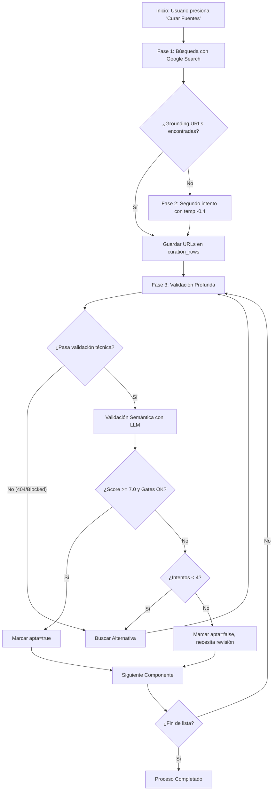

# Documentación Técnica: Paso 4 - Lógica de Negocio y Backend

Este documento detalla la arquitectura, lógica de negocio y flujos de ejecución del **Paso 4: Curaduría de Contenidos**. El sistema implementa un pipeline robusto de búsqueda, generación y validación profunda para garantizar que cada componente instruccional tenga una fuente educativa de alta calidad.

---

## 1. Arquitectura de Fases

El proceso se divide en **3 Fases Secuenciales**, ejecutadas por background jobs en Netlify Functions (`curation-background.ts` y `validate-curation-background.ts`).

### Resumen de Fases

1.  **Fase 1: Búsqueda Inicial (Search)**
    - _Objetivo:_ Encontrar candidatos iniciales usando Google Search.
    - _Tech:_ `gemini-2.0-flash` + Tool `googleSearch`.
2.  **Fase 2: Recuperación (Recovery Round)**
    - _Objetivo:_ Cubrir huecos (`gaps`) que fallaron en Fase 1.
    - _Estrategia:_ Reintentos con temperatura ajustada y asignación de URLs de "grounding" excedentes.
3.  **Fase 3: Validación Profunda (Deep Validation)**
    - _Objetivo:_ Auditar calidad técnica y pedagógica.
    - _Tech:_ `gemini-2.5-pro` (razonamiento alto) + Algoritmo de Scoring.

---

## 2. Fase 1 y 2: Búsqueda y Generación (`curation-background.ts`)

### 2.1. Lógica de Anti-Alucinación (Grounding)

El sistema **no confía** ciegamente en las URLs que el texto del LLM genera. En su lugar:

1.  Extrae las `groundingChunks` (metadatos verificados por Google).
2.  Verifica que cada URL citada en el texto exista realmente en los `groundingChunks`.
3.  Si el modelo genera una URL que no está en el grounding, se marca como alucinación y se descarta o se reemplaza por una del grounding.

### 2.2. Resolución de Redirects

Las URLs provenientes de Vertex AI Search o Google suelen ser redirects temporales (e.g., `vertexaisearch.cloud.google.com...`).

- **Acción:** El backend sigue los redirects HTTP hasta obtener la URL final (canonical).
- **Tooling:** `resolveGoogleRedirect()` sigue la cadena de redirecciones y limpia la URL.

### 2.3. Configuración de Modelos (Search)

- **Modelo Principal:** `gemini-2.0-flash` (Veloz, eficiente con tools).
- **Temperatura:** 0.7 (Fase 1) -> 0.3 (Fase 2 - más determinista).

### 2.4. System Prompt de Búsqueda (Desde DB - `CURATION_PLAN`)

Este prompt se obtiene de la tabla `system_prompts` con `code = 'CURATION_PLAN'`. Si no existe, se usa el default:

```text
Eres un curador de contenido educativo. Usa Google Search para encontrar fuentes reales y verificables.
```

### 2.5. User Prompt de Búsqueda (Verbatim)

Este es el prompt completo que se construye dinámicamente para cada batch de componentes. Las variables como `${courseName}`, `${ideaCentral}`, y `${lessonsText}` se inyectan en tiempo de ejecución.

```text
BUSCA fuentes educativas usando Google Search para este curso:

CURSO: ${courseName}
TEMA: ${ideaCentral}

COMPONENTES:
${lessonsText}

${isRetry ? '⚠️ REINTENTO: Asegúrate de BUSCAR en Google para cada componente. NO inventes URLs.' : ''}

INSTRUCCIONES:
1. DEBES usar Google Search para cada componente
2. Busca: artículos, guías, casos de estudio de universidades, consultoras, instituciones
3. NO inventes URLs - solo usa las que encuentres en Google
4. Evita: YouTube, redes sociales, Medium, sitios con paywall

RESPONDE en JSON:
{
  "sources_by_lesson": [
    {
      "lesson_id": "ID",
      "lesson_title": "TITULO",
      "components": [
        {
          "component_name": "TIPO",
          "is_critical": true/false,
          "candidate_sources": [
            {
              "title": "Título",
              "url": "URL de Google Search",
              "rationale": "Por qué es útil"
            }
          ]
        }
      ]
    }
  ]
}

Solo JSON válido, sin explicaciones.
```

**Nota sobre `${lessonsText}`:** Se genera dinámicamente así:

```text
- Lección 1: Introducción (ID: L1) -> VIDEO [CRITICO]
- Lección 1: Introducción (ID: L1) -> READING
- Lección 2: Conceptos Básicos (ID: L2) -> QUIZ
...
```

---

## 3. Fase 3: Validación Profunda (`validate-curation-background.ts`)

Esta es la capa de control de calidad más estricta. Se ejecuta sobre cada URL generada.

### 3.1. Validación Técnica (Pre-LLM)

Antes de invocar a la IA, se realizan chequeos programáticos para descartar basura:

| Chequeo           | Descripción                                                          | Acción si Falla                    |
| :---------------- | :------------------------------------------------------------------- | :--------------------------------- |
| **Blocklist**     | Dominios prohibidos (Youtube, Facebook, Reddit, etc.)                | Rechazo Inmediato                  |
| **HTTP Status**   | Verifica status 200 OK                                               | Rechazo (Retry)                    |
| **Soft 404**      | Analiza `<title>` y `<h1>` buscando "Not Found", "Error", "404"      | Rechazo (Retry)                    |
| **Homepage**      | Regex (`/`, `/index`, `/home`) + Keyword scan ("Welcome", "Sign up") | Rechazo Inmediato                  |
| **Word Count**    | < 150 palabras                                                       | Rechazo Inmediato                  |
| **Short Content** | < 300 palabras                                                       | Warning (Requiere revisión manual) |

### 3.2. Validación Semántica (Scoring IA)

Si pasa los filtros técnicos, el contenido (hasta 8000 caracteres) se envía al modelo de validación.

- **Modelo:** `gemini-2.5-pro` (o configurado en `curation_settings`).
- **Temperatura:** 0.1 (Casi determinista).

#### Sistema de Puntuación (1-10)

1.  **Relevance**: ¿Relacionado con el tema _específico_ de la lección?
2.  **Depth**: ¿Tiene profundidad y sustancia?
3.  **Quality**: ¿Bien escrito, estructurado, autoridad?
4.  **Applicability**: ¿Útil para el estudiante?

#### Compuertas Booleanas (Gates)

Son condiciones de rechazo automático ("Kill conditions"):

- `is_homepage_or_index`: Si es True -> **FAIL**
- `is_specific_to_topic`: Si es False -> **FAIL**
- `is_educational`: Si es False (Marketing/Clickbait) -> **FAIL**
- `has_depth`: Si es False -> **FAIL**

#### Criterio de Aprobación

```javascript
Aprobado = (AverageScore >= 7.0) AND (MinSingleScore > 4.0) AND (AllGates == PASS)
```

### 3.3. Prompt de Validación (Verbatim - Template ULTRA-ESTRICTO)

Este es el prompt completo que se usa para validar cada URL. Las variables `${component.*}`, `${url}`, y `${pageContent.*}` se inyectan dinámicamente.

```text
TAREA CRÍTICA: Determina si esta página web es una FUENTE EDUCATIVA ESPECÍFICA y SUSTANCIAL.

═══════════════════════════════════════════════════════════════════
COMPONENTE EDUCATIVO QUE NECESITAMOS CUBRIR:
═══════════════════════════════════════════════════════════════════
- Lección del curso: "${component.lesson_title || component.title || 'Sin título'}"
- Tipo de contenido requerido: ${component.component || component.type || 'Artículo educativo'}
- Descripción/Objetivo: ${component.source_rationale || component.description || 'Contenido educativo sobre el tema'}

═══════════════════════════════════════════════════════════════════
PÁGINA WEB A EVALUAR:
═══════════════════════════════════════════════════════════════════
- URL: ${url}
- Título de la página: ${pageContent.title || '[Sin título]'}
- Palabras extraídas: ${pageContent.wordCount}

=== CONTENIDO DE LA PÁGINA (primeras 3000 palabras) ===
${pageContent.content || '[ERROR: No se pudo extraer contenido]'}
=== FIN DEL CONTENIDO ===

═══════════════════════════════════════════════════════════════════
EVALUACIÓN ULTRA-ESTRICTA - DEBES VERIFICAR CADA PUNTO:
═══════════════════════════════════════════════════════════════════

PASO 1: ¿ES UNA PÁGINA DE INICIO, ÍNDICE O LANDING PAGE?
- ¿La página lista múltiples artículos/productos/servicios sin profundizar en ninguno?
- ¿El contenido principal son enlaces a otras páginas?
- ¿Es una página "Acerca de", "Inicio", "Servicios", "Productos"?
- ¿El contenido es mayormente navegación, menús, o categorías?
→ Si CUALQUIERA es SÍ: is_homepage_or_index = true, is_approved = false

PASO 2: ¿EL CONTENIDO ES ESPECÍFICO AL TEMA "${component.lesson_title || component.title}"?
- ¿El TEMA PRINCIPAL de la página es exactamente sobre "${component.lesson_title || component.title}"?
- ¿O solo MENCIONA el tema de pasada como parte de una lista?
- ¿La página está DEDICADA a explicar este tema específico?
- ¿Un estudiante buscando "${component.lesson_title || component.title}" encontraría lo que necesita?
→ Si el tema NO es el foco principal: is_specific_to_topic = false, is_approved = false

PASO 3: ¿ES CONTENIDO GENUINAMENTE EDUCATIVO?
- ¿Explica conceptos con claridad pedagógica?
- ¿Tiene ejemplos, código, diagramas, o pasos a seguir?
- ¿O es contenido de marketing disfrazado de educación?
- ¿Es un artículo de noticias sin valor de aprendizaje?
- ¿Solo promociona un producto/servicio?
→ Si NO es educativo real: is_educational = false, is_approved = false

PASO 4: ¿TIENE PROFUNDIDAD SUFICIENTE?
- ¿Tiene al menos 3-5 párrafos sustanciales sobre el tema?
- ¿Explica el "por qué" y el "cómo", no solo el "qué"?
- ¿Un principiante podría APRENDER el tema leyendo esta página?
- ¿Hay información que el estudiante no encontraría en una simple búsqueda?
→ Si es superficial: has_depth = false, is_approved = false

PASO 5: ANÁLISIS DE CONTRADICCIONES
- ¿Hay información que contradiga prácticas actuales aceptadas?
- ¿Hay afirmaciones que puedan confundir al estudiante?
- ¿La información está desactualizada?
→ Documentar en feedback_notes con prefijo [CONTRADICCIÓN] o [CONFLICTO]

═══════════════════════════════════════════════════════════════════
CRITERIOS DE PUNTUACIÓN (1-10):
═══════════════════════════════════════════════════════════════════
- relevance: ¿Qué tan relacionado está con "${component.lesson_title || component.title}"? (1=nada, 10=exacto)
- depth: ¿Qué tan profundo es el contenido? (1=superficial, 10=exhaustivo)
- quality: ¿Qué tan bien escrito y estructurado está? (1=pobre, 10=excelente)
- applicability: ¿Qué tan útil es para un estudiante? (1=inútil, 10=muy útil)

═══════════════════════════════════════════════════════════════════
REGLAS DE APROBACIÓN ESTRICTAS:
═══════════════════════════════════════════════════════════════════
RECHAZAR AUTOMÁTICAMENTE (is_approved: false) si:
✗ Es página de inicio, índice, landing page, o "about us"
✗ El tema principal NO es "${component.lesson_title || component.title}"
✗ Tiene menos de 300 palabras de contenido educativo real
✗ Es contenido de marketing, ventas, o promocional
✗ Solo lista enlaces sin contenido propio
✗ El promedio de puntuación es < 7.0
✗ Cualquier puntuación individual es ≤ 4

APROBAR (is_approved: true) SOLO si:
✓ La página está DEDICADA específicamente al tema
✓ Tiene contenido educativo sustancial (explicaciones, ejemplos)
✓ Un estudiante realmente APRENDERÍA el tema leyendo esto
✓ Todas las puntuaciones son ≥ 5 Y el promedio es ≥ 7.0

Responde ÚNICAMENTE con JSON válido (sin markdown):
{
  "is_homepage_or_index": <true si es página de inicio/índice/landing>,
  "is_specific_to_topic": <true si el tema principal es el correcto>,
  "is_educational": <true si es contenido educativo real>,
  "has_depth": <true si tiene profundidad suficiente>,
  "relevance": <1-10>,
  "depth": <1-10>,
  "quality": <1-10>,
  "applicability": <1-10>,
  "average": <promedio exacto de los 4 scores>,
  "rejection_reasons": ["razón1", "razón2"] o [] si aprobado,
  "feedback_notes": "<explicación detallada de por qué se aprueba o rechaza>",
  "is_approved": <true o false>
}
```

---

## 4. Flujo de Resiliencia (Retry Loop)

El sistema implementa un bucle de "autocorrección" en Fase 3.

**Algoritmo:**

1.  Validar URL actual.
2.  Si `is_approved == true` -> Guardar y Terminar.
3.  Si `is_approved == false` OR Error Técnico:
    - Incrementar contador de intentos.
    - Si `intentos < MAX_ATTEMPTS (4)`:
      - Llamar a `searchAlternativeUrl()` usando `gemini-2.5-pro`.
      - Buscar _nueva_ URL para el mismo componente.
      - Volver al paso 1 con la nueva URL.
    - Si `intentos >= MAX_ATTEMPTS`:
      - Marcar como `apta: false`.
      - Dejar nota de error para curador humano.

Este mecanismo asegura que el sistema trabaje activamente para corregir sus propios fallos de búsqueda inicial, elevando drásticamente la tasa de éxito final sin intervención humana.

---

## 5. Diagrama de Flujo General


