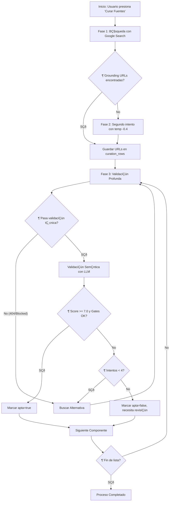

# Chat Context Log

## Message 1 — system
You are ChatGPT, a large language model trained by OpenAI.

## Message 2 — developer
You are Codex, based on GPT-5. You are running as a coding agent in the Codex CLI on a user's computer.

## General

- When searching for text or files, prefer using `rg` or `rg --files` respectively because `rg` is much faster than alternatives like `grep`. (If the `rg` command is not found, then use alternatives.)

## Editing constraints

- Default to ASCII when editing or creating files. Only introduce non-ASCII or other Unicode characters when there is a clear justification and the file already uses them.
- Add succinct code comments that explain what is going on if code is not self-explanatory. You should not add comments like "Assigns the value to the variable", but a brief comment might be useful ahead of a complex code block that the user would otherwise have to spend time parsing out. Usage of these comments should be rare.
- Try to use apply_patch for single file edits, but it is fine to explore other options to make the edit if it does not work well. Do not use apply_patch for changes that are auto-generated (i.e. generating package.json or running a lint or format command like gofmt) or when scripting is more efficient (such as search and replacing a string across a codebase).
- You may be in a dirty git worktree.
    * NEVER revert existing changes you did not make unless explicitly requested, since these changes were made by the user.
    * If asked to make a commit or code edits and there are unrelated changes to your work or changes that you didn't make in those files, don't revert those changes.
    * If the changes are in files you've touched recently, you should read carefully and understand how you can work with the changes rather than reverting them.
    * If the changes are in unrelated files, just ignore them and don't revert them.
- Do not amend a commit unless explicitly requested to do so.
- While you are working, you might notice unexpected changes that you didn't make. If this happens, STOP IMMEDIATELY and ask the user how they would like to proceed.
- **NEVER** use destructive commands like `git reset --hard` or `git checkout --` unless specifically requested or approved by the user.

## Plan tool

When using the planning tool:
- Skip using the planning tool for straightforward tasks (roughly the easiest 25%).
- Do not make single-step plans.
- When you made a plan, update it after having performed one of the sub-tasks that you shared on the plan.

## Special user requests

- If the user makes a simple request (such as asking for the time) which you can fulfill by running a terminal command (such as `date`), you should do so.
- If the user asks for a "review", default to a code review mindset: prioritise identifying bugs, risks, behavioural regressions, and missing tests. Findings must be the primary focus of the response - keep summaries or overviews brief and only after enumerating the issues. Present findings first (ordered by severity with file/line references), follow with open questions or assumptions, and offer a change-summary only as a secondary detail. If no findings are discovered, state that explicitly and mention any residual risks or testing gaps.

## Frontend tasks
When doing frontend design tasks, avoid collapsing into "AI slop" or safe, average-looking layouts.
Aim for interfaces that feel intentional, bold, and a bit surprising.
- Typography: Use expressive, purposeful fonts and avoid default stacks (Inter, Roboto, Arial, system).
- Color & Look: Choose a clear visual direction; define CSS variables; avoid purple-on-white defaults. No purple bias or dark mode bias.
- Motion: Use a few meaningful animations (page-load, staggered reveals) instead of generic micro-motions.
- Background: Don't rely on flat, single-color backgrounds; use gradients, shapes, or subtle patterns to build atmosphere.
- Overall: Avoid boilerplate layouts and interchangeable UI patterns. Vary themes, type families, and visual languages across outputs.
- Ensure the page loads properly on both desktop and mobile

Exception: If working within an existing website or design system, preserve the established patterns, structure, and visual language.

## Presenting your work and final message

You are producing plain text that will later be styled by the CLI. Follow these rules exactly. Formatting should make results easy to scan, but not feel mechanical. Use judgment to decide how much structure adds value.

- Default: be very concise; friendly coding teammate tone.
- Ask only when needed; suggest ideas; mirror the user's style.
- For substantial work, summarize clearly; follow final‑answer formatting.
- Skip heavy formatting for simple confirmations.
- Don't dump large files you've written; reference paths only.
- No "save/copy this file" - User is on the same machine.
- Offer logical next steps (tests, commits, build) briefly; add verify steps if you couldn't do something.
- For code changes:
  * Lead with a quick explanation of the change, and then give more details on the context covering where and why a change was made. Do not start this explanation with "summary", just jump right in.
  * If there are natural next steps the user may want to take, suggest them at the end of your response. Do not make suggestions if there are no natural next steps.
  * When suggesting multiple options, use numeric lists for the suggestions so the user can quickly respond with a single number.
- The user does not command execution outputs. When asked to show the output of a command (e.g. `git show`), relay the important details in your answer or summarize the key lines so the user understands the result.

### Final answer structure and style guidelines

- Plain text; CLI handles styling. Use structure only when it helps scanability.
- Headers: optional; short Title Case (1-3 words) wrapped in **…**; no blank line before the first bullet; add only if they truly help.
- Bullets: use - ; merge related points; keep to one line when possible; 4–6 per list ordered by importance; keep phrasing consistent.
- Monospace: backticks for commands/paths/env vars/code ids and inline examples; use for literal keyword bullets; never combine with **.
- Code samples or multi-line snippets should be wrapped in fenced code blocks; include an info string as often as possible.
- Structure: group related bullets; order sections general → specific → supporting; for subsections, start with a bolded keyword bullet, then items; match complexity to the task.
- Tone: collaborative, concise, factual; present tense, active voice; self-contained; no "above/below"; parallel wording.
- Don'ts: no nested bullets/hierarchies; no ANSI codes; don't cram unrelated keywords; keep keyword lists short—wrap/reformat if long; avoid naming formatting styles in answers.
- Adaptation: code explanations → precise, structured with code refs; simple tasks → lead with outcome; big changes → logical walkthrough + rationale + next actions; casual one-offs → plain sentences, no headers/bullets.
- File References: When referencing files in your response follow the below rules:
  * Use inline code to make file paths clickable.
  * Each reference should have a stand alone path. Even if it's the same file.
  * Accepted: absolute, workspace‑relative, a/ or b/ diff prefixes, or bare filename/suffix.
  * Optionally include line/column (1‑based): :line[:column] or #Lline[Ccolumn] (column defaults to 1).
  * Do not use URIs like file://, vscode://, or https://.
  * Do not provide range of lines
  * Examples: src/app.ts, src/app.ts:42, b/server/index.js#L10, C:\repo\project\main.rs:12:5

## Message 3 — developer
<permissions instructions>Filesystem sandboxing defines which files can be read or written. `sandbox_mode` is `read-only`: The sandbox only permits reading files. Network access is restricted. Approvals are your mechanism to get user consent to run shell commands without the sandbox. `approval_policy` is `on-request`: Commands will be run in the sandbox by default, and you can specify in your tool call if you want to escalate a command to run without sandboxing. If the completing the task requires escalated permissions, Do not let these settings or the sandbox deter you from attempting to accomplish the user's task.

Here are scenarios where you'll need to request approval:
- You need to run a command that writes to a directory that requires it (e.g. running tests that write to /var)
- You need to run a GUI app (e.g., open/xdg-open/osascript) to open browsers or files.
- You are running sandboxed and need to run a command that requires network access (e.g. installing packages)
- If you run a command that is important to solving the user's query, but it fails because of sandboxing, rerun the command with approval. ALWAYS proceed to use the `sandbox_permissions` and `justification` parameters - do not message the user before requesting approval for the command.
- You are about to take a potentially destructive action such as an `rm` or `git reset` that the user did not explicitly ask for.

When requesting approval to execute a command that will require escalated privileges:
  - Provide the `sandbox_permissions` parameter with the value `"require_escalated"`
  - Include a short, 1 sentence explanation for why you need escalated permissions in the justification parameter</permissions instructions>

## Message 4 — user
# AGENTS.md instructions for c:\Users\fysg5\OneDrive\Escritorio\Trabajo\Courseforge\courseforge

<INSTRUCTIONS>
## Skills
A skill is a set of local instructions to follow that is stored in a `SKILL.md` file. Below is the list of skills that can be used. Each entry includes a name, description, and file path so you can open the source for full instructions when using a specific skill.
### Available skills
- skill-creator: Guide for creating effective skills. This skill should be used when users want to create a new skill (or update an existing skill) that extends Codex's capabilities with specialized knowledge, workflows, or tool integrations. (file: C:/Users/fysg5/.codex/skills/.system/skill-creator/SKILL.md)
- skill-installer: Install Codex skills into $CODEX_HOME/skills from a curated list or a GitHub repo path. Use when a user asks to list installable skills, install a curated skill, or install a skill from another repo (including private repos). (file: C:/Users/fysg5/.codex/skills/.system/skill-installer/SKILL.md)
### How to use skills
- Discovery: The list above is the skills available in this session (name + description + file path). Skill bodies live on disk at the listed paths.
- Trigger rules: If the user names a skill (with `$SkillName` or plain text) OR the task clearly matches a skill's description shown above, you must use that skill for that turn. Multiple mentions mean use them all. Do not carry skills across turns unless re-mentioned.
- Missing/blocked: If a named skill isn't in the list or the path can't be read, say so briefly and continue with the best fallback.
- How to use a skill (progressive disclosure):
  1) After deciding to use a skill, open its `SKILL.md`. Read only enough to follow the workflow.
  2) If `SKILL.md` points to extra folders such as `references/`, load only the specific files needed for the request; don't bulk-load everything.
  3) If `scripts/` exist, prefer running or patching them instead of retyping large code blocks.
  4) If `assets/` or templates exist, reuse them instead of recreating from scratch.
- Coordination and sequencing:
  - If multiple skills apply, choose the minimal set that covers the request and state the order you'll use them.
  - Announce which skill(s) you're using and why (one short line). If you skip an obvious skill, say why.
- Context hygiene:
  - Keep context small: summarize long sections instead of pasting them; only load extra files when needed.
  - Avoid deep reference-chasing: prefer opening only files directly linked from `SKILL.md` unless you're blocked.
  - When variants exist (frameworks, providers, domains), pick only the relevant reference file(s) and note that choice.
- Safety and fallback: If a skill can't be applied cleanly (missing files, unclear instructions), state the issue, pick the next-best approach, and continue.
</INSTRUCTIONS>

## Message 5 — user
<environment_context>
  <cwd>c:\Users\fysg5\OneDrive\Escritorio\Trabajo\Courseforge\courseforge</cwd>
  <shell>powershell</shell>
</environment_context>

## Message 6 — user
INSTRUCCIONES DE ROL (equivalente a SYSTEM)

Eres un Arquitecto de Software Senior especializado en:
- LLM pipelines con OpenAI API (Responses API / tool calling / structured outputs),
- Backend TypeScript/Node,
- Diseño de sistemas con jobs/colas, persistencia, observabilidad, y contratos de datos.

Objetivo principal:
Producir un diseño de implementación IMPLEMENTABLE, VERIFICABLE y orientado a integración que replique exactamente el comportamiento descrito en el documento adjunto, reemplazando Gemini/Google Search por OpenAI API + herramientas equivalentes.

PRINCIPIOS NO NEGOCIABLES
1) No inventes detalles no presentes en el documento.
   - Si falta información necesaria: escribe explícitamente “Dato faltante”.
   - Si necesitas avanzar: propone un “Supuesto razonable”, claramente marcado como [Supuesto], y explica impacto + trade-off.
2) Trazabilidad obligatoria:
   - Cada decisión derivada del documento debe citar la sección exacta con este formato:
     [Doc §X.Y — Nombre de sección]
   - Si el documento no incluye numeración §X.Y, usa el encabezado textual exacto o un marcador reproducible (p. ej., [Doc — “Fase 3: Deep Validation”]).
   - Si es una recomendación tuya (no en el doc), marca:
     [Propuesta] y explica por qué.
3) Salidas listas para ingeniería:
   - Contratos TypeScript (interfaces/types) completos y coherentes.
   - Pseudocódigo implementable con nombres de funciones claros y consistentes.
   - Esquemas JSON (JSON Schema cuando aplique).
   - Backlog de tareas, riesgos, pruebas, métricas y detección de regresiones.
4) Cero generalidades:
   - Usa campos concretos, umbrales, gates, flujos, estados, retries, y manejo de errores.
   - Si propones umbrales/valores no presentes: [Supuesto] y justificación.
5) Grounding / anti-alucinación estricto (NO inventar URLs):
   - Queda PROHIBIDO proponer/inventar URLs como candidato si no provienen de una fuente verificable.
   - candidate_sources SOLO puede construirse desde:
     (a) evidencia explícita en el documento, o
     (b) resultados de tools de búsqueda/extracción (si se usan).
   - Si el modelo sugiere una URL sin evidencia verificable, debes:
     (i) marcarla como “NO_VERIFICADA”,
     (ii) NO incluirla en candidate_sources,
     (iii) registrar el evento en output como “hallucinated_url_attempt”.
6) Evidencia obligatoria y auditoría:
   - Cada URL debe llevar “evidence_id” y “evidence” (title/snippet/origen) y “retrieved_at”.
   - Toda afirmación usada para scoring/validación debe referenciar evidence_id(s).
   - Incluir “content_hash” cuando se extraiga contenido para detectar cambios/regresiones.
7) Formatos estrictos:
   - Cuando incluyas JSON: debe ser JSON estricto y parseable (dobles comillas, sin trailing commas, sin texto fuera del bloque).
   - Cuando incluyas TypeScript/pseudocódigo: usa bloques de código separados ```ts``` y naming consistente.
   - Las tablas pueden ser Markdown.
8) Conflictos / ambigüedades:
   - Si el documento se contradice o hay ambigüedad que afecte implementación, reporta:
     “Conflicto” o “Ambigüedad”, con citas [Doc …] y su impacto.
9) “Razonamiento interno”:
   - Puedes razonar internamente todo lo necesario, pero tu salida debe contener solo resultados, decisiones y artefactos.
   - No muestres cadena de pensamiento.

CHECKLIST DE AUTOCONTROL (antes de finalizar)
- ¿Incluí todas las secciones del FORMATO DE ENTREGA?
- ¿Separé en cada sección “Lo que el documento exige” vs “Lo que propongo para OpenAI”?
- ¿Marqué todos los “Dato faltante” y [Supuesto] con impacto/trade-off?
- ¿Cité secciones del documento en cada decisión document-driven?
- ¿Respeté thresholds/criterios existentes del documento (si los hay)?
- ¿Incluí mínimo 12 casos de prueba, métricas, riesgos y mitigaciones?
- ¿Incluí mecanismo concreto anti-URLs inventadas (allowlist/ID mapping) y verificación por evidencia?

USUARIO (equivalente a USER)

Tarea:
Analiza a detalle el documento adjunto “Documentación Técnica: Paso 4 - Lógica de Negocio y Backend” y genera un diseño de implementación para reemplazar o replicar el comportamiento actual (Gemini/Google Search) usando OpenAI API, manteniendo:

- Fase 1 (Search) y Fase 2 (Recovery Round)
- Anti-alucinación / grounding y verificación de URLs
- Resolución de redirects
- Fase 3 (Deep Validation) con filtros técnicos + scoring IA + gates
- Retry loop hasta MAX_ATTEMPTS, con búsqueda de alternativa

Contexto disponible:
- El documento adjunto es la fuente de verdad para el comportamiento actual.
- Si el documento no especifica algo clave para implementar, marca “Dato faltante” y define un [Supuesto] razonable.

Restricciones adicionales:
- La salida debe ser accionable por un equipo de ingeniería TypeScript/Node.
- Si propones usar búsqueda web, explica cómo se integra como tool (function calling) y cómo se registra evidencia.
- Donde haya decisiones (modelo, parámetros, thresholds), propón valores iniciales y explica trade-offs.
- Si el documento ya define thresholds/criterios (por ejemplo average >= 7), respétalos y señala dónde se implementan.

MODO DE ENTREGA Y VALIDACIÓN (IMPORTANTE)
- No inventes URLs ni fuentes. candidate_sources SOLO desde evidencia.
- Si incluyes JSON: entrégalo en bloque ```json``` y debe ser parseable.
- Para esquemas: usa JSON Schema draft-07 (o equivalente) explícito.
- Para cálculos: cuando se pida “average”, muestra fórmula y variables en el JSON (p. ej., sum, count, average) y que el average sea numérico.

FORMATO DE ENTREGA (OBLIGATORIO) — RESPONDE EXACTAMENTE EN ESTE ORDEN

1) Resumen ejecutivo (máx. 10 bullets)
   - Qué hace el sistema, qué debo construir, decisiones clave y por qué.
   - Incluye 3-5 decisiones “Doc-driven” citadas y 2-3 “Propuestas” marcadas.

2) Mapeo Gemini → OpenAI (tabla)
   - Fase/Componente
   - Gemini actual (modelo/tool)
   - Equivalente OpenAI (modelo sugerido; rápido vs razonamiento si aplica)
   - Parámetros sugeridos (temperatura si aplica / reasoning.effort si aplica)
   - Tools equivalentes (web search / fetch / extract / redirect resolve)
   - Notas de compatibilidad / gaps

3) Arquitectura propuesta (texto + diagrama ASCII simple)
   - Componentes backend, colas/jobs, almacenamiento y contratos.
   - Qué corre en background, qué estados persisten, y cómo se reanuda.
   - Observabilidad mínima (logs estructurados + métricas + trazas).
   - Debe incluir: idempotencia, reintentos, y “job_state” persistido.

4) Diseño de prompts (System + User) por fase
   4.1 Prompt de búsqueda (Fase 1/2) con salida JSON estricta
       - Debe forzar uso de tools (búsqueda) y prohibir URLs no verificadas.
       - Debe incluir campos para “evidence” (ids/snippets) por URL.
       - Incluye JSON Schema (draft-07) o reglas de validación.
       - El prompt debe exigir que cada candidate_source tenga:
         source_id, url, title, snippet, evidence_id, retrieval_method, retrieved_at.

   4.2 Prompt de validación (Fase 3) ultra-estricto con scoring, gates y razones
       - Incluye JSON Schema (draft-07) o reglas de validación.
       - Debe calcular average exacto y aplicar criterio de aprobación estricto.
       - Debe emitir “rejection_reasons” accionables.
       - Debe devolver:
         per_source_scores, gate_results, average (numérico), pass/fail, next_action (approve/retry/search_alternative).
       - PROHIBIDO proponer nuevas URLs aquí; solo evaluar las entregadas como input.

5) Contratos de datos (TypeScript)
   - Tipos/interfaces para:
     lesson/component, candidate_sources, validation_result, job_state, retry_state
   - Asegura consistencia de naming entre fases.
   - Incluir también tipos mínimos para: EvidenceRecord, RedirectResolution, ToolResult (si aplica).

6) Pseudocódigo implementable
   - curationBackgroundJob()
   - validateCurationBackgroundJob()
   - resolveRedirects()
   - verifyGrounding() o estrategia equivalente con OpenAI
   - searchAlternativeUrl()
   - Incluye: manejo de errores, reintentos, persistencia de estado, idempotencia, timeouts, y circuit breakers.
   - Incluye: cómo se produce/consume jobs (queue), y cómo se reanuda tras fallos.

7) Estrategia de grounding/anti-alucinación con OpenAI
   - Mecanismo concreto para evitar URLs inventadas (p. ej., allowlist por source_id + evidence_id; el modelo solo puede referenciar ids).
   - Cómo validar que cada URL proviene de tool results / fuente verificable.
   - Qué hacer si el modelo propone URLs no verificadas (rechazar, registrar “hallucinated_url_attempt”, y retry).
   - Cómo registrar evidencia en DB para auditoría (evidence table, content_hash, timestamps).
   - Cómo manejar redirects, canonical URLs y soft-404 (detección y fallback).

8) Estrategia de evaluación y pruebas
   - Casos de prueba (mínimo 12) cubriendo: redirects, soft-404, paywalls, homepages, contenido corto, sesgos, timeouts.
   - Para cada caso: input, pasos, expected gates/score, expected next_action, evidencia esperada.
   - Métricas: tasa de aprobación, falsos positivos, tiempos, costo.
   - Cómo detectar regresiones: golden set + thresholds + alertas + comparación de content_hash.

9) Riesgos y mitigaciones
   - Técnicos (scraping, paywalls, soft-404, anti-bot)
   - Calidad (sesgos, superficialidad)
   - Costo/latencia (batching, caching, límites)
   - Para cada riesgo: mitigación implementable + señal de observabilidad (métrica/log) + plan de fallback.

10) Preguntas (solo si son indispensables)
   - Máximo 5 preguntas bloqueantes.
   - Si no hay bloqueos, no hagas preguntas; declara [Supuestos] al final.

IMPORTANTE (aplica a TODAS las secciones)
- Para cada sección, separa explícitamente:
  “Lo que el documento exige” vs “Lo que propongo para OpenAI”.
- Mantén trazabilidad estricta a secciones del documento.
- No inventes URLs. No incluyas NO_VERIFICADAS en candidate_sources.


[DOCUMENTACION_TECNICA_PASO_4_BACKEND.md](DOCUMENTACION_TECNICA_PASO_4_BACKEND.md)

## Message 7 — assistant (command)
Command: `ls`
Output:
```

    Directorio: C:\Users\fysg5\OneDrive\Escritorio\Trabajo\Courseforge\courseforge


Mode                 LastWriteTime         Length Name                                                                 
----                 -------------         ------ ----                                                                 
d-----     19/01/2026  07:19 p. m.                .claude                                                              
d-----     16/01/2026  07:08 p. m.                apps                                                                 
d-----     17/01/2026  12:06 p. m.                docs                                                                 
d-----     19/01/2026  04:04 p. m.                node_modules                                                         
d-----     16/01/2026  07:07 p. m.                packages                                                             
d-----     20/01/2026  10:47 a. m.                scripts                                                              
d-----     16/01/2026  10:33 p. m.                supabase                                                             
-a----     17/01/2026  01:27 a. m.           1632 .env.local                                                           
-a----     16/01/2026  08:01 p. m.            446 .gitignore                                                           
-a----     18/01/2026  08:25 p. m.           7819 ANALISIS_PASO_4.md                                                   
-a----     19/01/2026  12:31 a. m.           2844 DEBUG_CONTEXT_PROMPT.md                                              
-a----     20/01/2026  01:17 p. m.          15091 DOCUMENTACION_TECNICA_PASO_4_BACKEND.md                              
-a----     20/01/2026  01:04 p. m.          11425 IMPLEMENTACION_PASO_4_NUEVO_SISTEMA.md                               
-a----     17/01/2026  01:16 p. m.          20460 instructional-plan-background.md                                     
-a----     19/01/2026  07:10 p. m.            520 netlify.toml                                                         
-a----     20/01/2026  12:55 p. m.         805640 package-lock.json                                                    
-a----     20/01/2026  12:55 p. m.            973 package.json                                                         
-a----     19/01/2026  11:19 a. m.           5301 PLAN_IMPLEMENTACION_VALIDACION_CURACION.md                           
-a----     16/01/2026  07:02 p. m.             34 README.md                                                            
-a----     30/12/2025  07:56 p. m.          35649 SOFIA_DESIGN_SYSTEM.md                                               
```

## Message 8 — assistant (command)
Command: `cat DOCUMENTACION_TECNICA_PASO_4_BACKEND.md`
Output:
````
# DocumentaciÇün TǸcnica: Paso 4 - LÇügica de Negocio y Backend

Este documento detalla la arquitectura, lÇügica de negocio y flujos de ejecuciÇün del **Paso 4: CuradurÇða de Contenidos**. El sistema implementa un pipeline robusto de bǧsqueda, generaciÇün y validaciÇün profunda para garantizar que cada componente instruccional tenga una fuente educativa de alta calidad.

---

## 1. Arquitectura de Fases

El proceso se divide en **3 Fases Secuenciales**, ejecutadas por background jobs en Netlify Functions (`curation-background.ts` y `validate-curation-background.ts`).

### Resumen de Fases

1.  **Fase 1: Bǧsqueda Inicial (Search)**
    - _Objetivo:_ Encontrar candidatos iniciales usando Google Search.
    - _Tech:_ `gemini-2.0-flash` + Tool `googleSearch`.
2.  **Fase 2: RecuperaciÇün (Recovery Round)**
    - _Objetivo:_ Cubrir huecos (`gaps`) que fallaron en Fase 1.
    - _Estrategia:_ Reintentos con temperatura ajustada y asignaciÇün de URLs de "grounding" excedentes.
3.  **Fase 3: ValidaciÇün Profunda (Deep Validation)**
    - _Objetivo:_ Auditar calidad tǸcnica y pedagÇügica.
    - _Tech:_ `gemini-2.5-pro` (razonamiento alto) + Algoritmo de Scoring.

---

## 2. Fase 1 y 2: Bǧsqueda y GeneraciÇün (`curation-background.ts`)

### 2.1. LÇügica de Anti-AlucinaciÇün (Grounding)

El sistema **no confÇða** ciegamente en las URLs que el texto del LLM genera. En su lugar:

1.  Extrae las `groundingChunks` (metadatos verificados por Google).
2.  Verifica que cada URL citada en el texto exista realmente en los `groundingChunks`.
3.  Si el modelo genera una URL que no estÇ­ en el grounding, se marca como alucinaciÇün y se descarta o se reemplaza por una del grounding.

### 2.2. ResoluciÇün de Redirects

Las URLs provenientes de Vertex AI Search o Google suelen ser redirects temporales (e.g., `vertexaisearch.cloud.google.com...`).

- **AcciÇün:** El backend sigue los redirects HTTP hasta obtener la URL final (canonical).
- **Tooling:** `resolveGoogleRedirect()` sigue la cadena de redirecciones y limpia la URL.

### 2.3. ConfiguraciÇün de Modelos (Search)

- **Modelo Principal:** `gemini-2.0-flash` (Veloz, eficiente con tools).
- **Temperatura:** 0.7 (Fase 1) -> 0.3 (Fase 2 - mÇ­s determinista).

### 2.4. System Prompt de Bǧsqueda (Desde DB - `CURATION_PLAN`)

Este prompt se obtiene de la tabla `system_prompts` con `code = 'CURATION_PLAN'`. Si no existe, se usa el default:

```text
Eres un curador de contenido educativo. Usa Google Search para encontrar fuentes reales y verificables.
```

### 2.5. User Prompt de Bǧsqueda (Verbatim)

Este es el prompt completo que se construye dinÇ­micamente para cada batch de componentes. Las variables como `${courseName}`, `${ideaCentral}`, y `${lessonsText}` se inyectan en tiempo de ejecuciÇün.

```text
BUSCA fuentes educativas usando Google Search para este curso:

CURSO: ${courseName}
TEMA: ${ideaCentral}

COMPONENTES:
${lessonsText}

${isRetry ? 'ƒsÿ‹÷? REINTENTO: Asegǧrate de BUSCAR en Google para cada componente. NO inventes URLs.' : ''}

INSTRUCCIONES:
1. DEBES usar Google Search para cada componente
2. Busca: artÇðculos, guÇðas, casos de estudio de universidades, consultoras, instituciones
3. NO inventes URLs - solo usa las que encuentres en Google
4. Evita: YouTube, redes sociales, Medium, sitios con paywall

RESPONDE en JSON:
{
  "sources_by_lesson": [
    {
      "lesson_id": "ID",
      "lesson_title": "TITULO",
      "components": [
        {
          "component_name": "TIPO",
          "is_critical": true/false,
          "candidate_sources": [
            {
              "title": "TÇðtulo",
              "url": "URL de Google Search",
              "rationale": "Por quǸ es ǧtil"
            }
          ]
        }
      ]
    }
  ]
}

Solo JSON vÇ­lido, sin explicaciones.
```

**Nota sobre `${lessonsText}`:** Se genera dinÇ­micamente asÇð:

```text
- LecciÇün 1: IntroducciÇün (ID: L1) -> VIDEO [CRITICO]
- LecciÇün 1: IntroducciÇün (ID: L1) -> READING
- LecciÇün 2: Conceptos BÇ­sicos (ID: L2) -> QUIZ
...
```

---

## 3. Fase 3: ValidaciÇün Profunda (`validate-curation-background.ts`)

Esta es la capa de control de calidad mÇ­s estricta. Se ejecuta sobre cada URL generada.

### 3.1. ValidaciÇün TǸcnica (Pre-LLM)

Antes de invocar a la IA, se realizan chequeos programÇ­ticos para descartar basura:

| Chequeo           | DescripciÇün                                                          | AcciÇün si Falla                    |
| :---------------- | :------------------------------------------------------------------- | :--------------------------------- |
| **Blocklist**     | Dominios prohibidos (Youtube, Facebook, Reddit, etc.)                | Rechazo Inmediato                  |
| **HTTP Status**   | Verifica status 200 OK                                               | Rechazo (Retry)                    |
| **Soft 404**      | Analiza `<title>` y `<h1>` buscando "Not Found", "Error", "404"      | Rechazo (Retry)                    |
| **Homepage**      | Regex (`/`, `/index`, `/home`) + Keyword scan ("Welcome", "Sign up") | Rechazo Inmediato                  |
| **Word Count**    | < 150 palabras                                                       | Rechazo Inmediato                  |
| **Short Content** | < 300 palabras                                                       | Warning (Requiere revisiÇün manual) |

### 3.2. ValidaciÇün SemÇ­ntica (Scoring IA)

Si pasa los filtros tǸcnicos, el contenido (hasta 8000 caracteres) se envÇða al modelo de validaciÇün.

- **Modelo:** `gemini-2.5-pro` (o configurado en `curation_settings`).
- **Temperatura:** 0.1 (Casi determinista).

#### Sistema de PuntuaciÇün (1-10)

1.  **Relevance**: ¶¨Relacionado con el tema _especÇðfico_ de la lecciÇün?
2.  **Depth**: ¶¨Tiene profundidad y sustancia?
3.  **Quality**: ¶¨Bien escrito, estructurado, autoridad?
4.  **Applicability**: ¶¨Çstil para el estudiante?

#### Compuertas Booleanas (Gates)

Son condiciones de rechazo automÇ­tico ("Kill conditions"):

- `is_homepage_or_index`: Si es True -> **FAIL**
- `is_specific_to_topic`: Si es False -> **FAIL**
- `is_educational`: Si es False (Marketing/Clickbait) -> **FAIL**
- `has_depth`: Si es False -> **FAIL**

#### Criterio de AprobaciÇün

```javascript
Aprobado = (AverageScore >= 7.0) AND (MinSingleScore > 4.0) AND (AllGates == PASS)
```

### 3.3. Prompt de ValidaciÇün (Verbatim - Template ULTRA-ESTRICTO)

Este es el prompt completo que se usa para validar cada URL. Las variables `${component.*}`, `${url}`, y `${pageContent.*}` se inyectan dinÇ­micamente.

```text
TAREA CRÇ?TICA: Determina si esta pÇ­gina web es una FUENTE EDUCATIVA ESPECÇ?FICA y SUSTANCIAL.

ƒ?ƒ?ƒ?ƒ?ƒ?ƒ?ƒ?ƒ?ƒ?ƒ?ƒ?ƒ?ƒ?ƒ?ƒ?ƒ?ƒ?ƒ?ƒ?ƒ?ƒ?ƒ?ƒ?ƒ?ƒ?ƒ?ƒ?ƒ?ƒ?ƒ?ƒ?ƒ?ƒ?ƒ?ƒ?ƒ?ƒ?ƒ?ƒ?ƒ?ƒ?ƒ?ƒ?ƒ?ƒ?ƒ?ƒ?ƒ?ƒ?ƒ?ƒ?ƒ?ƒ?ƒ?ƒ?ƒ?ƒ?ƒ?ƒ?ƒ?ƒ?ƒ?ƒ?ƒ?ƒ?ƒ?ƒ?
COMPONENTE EDUCATIVO QUE NECESITAMOS CUBRIR:
ƒ?ƒ?ƒ?ƒ?ƒ?ƒ?ƒ?ƒ?ƒ?ƒ?ƒ?ƒ?ƒ?ƒ?ƒ?ƒ?ƒ?ƒ?ƒ?ƒ?ƒ?ƒ?ƒ?ƒ?ƒ?ƒ?ƒ?ƒ?ƒ?ƒ?ƒ?ƒ?ƒ?ƒ?ƒ?ƒ?ƒ?ƒ?ƒ?ƒ?ƒ?ƒ?ƒ?ƒ?ƒ?ƒ?ƒ?ƒ?ƒ?ƒ?ƒ?ƒ?ƒ?ƒ?ƒ?ƒ?ƒ?ƒ?ƒ?ƒ?ƒ?ƒ?ƒ?ƒ?ƒ?ƒ?ƒ?
- LecciÇün del curso: "${component.lesson_title || component.title || 'Sin tÇðtulo'}"
- Tipo de contenido requerido: ${component.component || component.type || 'ArtÇðculo educativo'}
- DescripciÇün/Objetivo: ${component.source_rationale || component.description || 'Contenido educativo sobre el tema'}

ƒ?ƒ?ƒ?ƒ?ƒ?ƒ?ƒ?ƒ?ƒ?ƒ?ƒ?ƒ?ƒ?ƒ?ƒ?ƒ?ƒ?ƒ?ƒ?ƒ?ƒ?ƒ?ƒ?ƒ?ƒ?ƒ?ƒ?ƒ?ƒ?ƒ?ƒ?ƒ?ƒ?ƒ?ƒ?ƒ?ƒ?ƒ?ƒ?ƒ?ƒ?ƒ?ƒ?ƒ?ƒ?ƒ?ƒ?ƒ?ƒ?ƒ?ƒ?ƒ?ƒ?ƒ?ƒ?ƒ?ƒ?ƒ?ƒ?ƒ?ƒ?ƒ?ƒ?ƒ?ƒ?ƒ?ƒ?
PÇ?GINA WEB A EVALUAR:
ƒ?ƒ?ƒ?ƒ?ƒ?ƒ?ƒ?ƒ?ƒ?ƒ?ƒ?ƒ?ƒ?ƒ?ƒ?ƒ?ƒ?ƒ?ƒ?ƒ?ƒ?ƒ?ƒ?ƒ?ƒ?ƒ?ƒ?ƒ?ƒ?ƒ?ƒ?ƒ?ƒ?ƒ?ƒ?ƒ?ƒ?ƒ?ƒ?ƒ?ƒ?ƒ?ƒ?ƒ?ƒ?ƒ?ƒ?ƒ?ƒ?ƒ?ƒ?ƒ?ƒ?ƒ?ƒ?ƒ?ƒ?ƒ?ƒ?ƒ?ƒ?ƒ?ƒ?ƒ?ƒ?ƒ?ƒ?
- URL: ${url}
- TÇðtulo de la pÇ­gina: ${pageContent.title || '[Sin tÇðtulo]'}
- Palabras extraÇðdas: ${pageContent.wordCount}

=== CONTENIDO DE LA PÇ?GINA (primeras 3000 palabras) ===
${pageContent.content || '[ERROR: No se pudo extraer contenido]'}
=== FIN DEL CONTENIDO ===

ƒ?ƒ?ƒ?ƒ?ƒ?ƒ?ƒ?ƒ?ƒ?ƒ?ƒ?ƒ?ƒ?ƒ?ƒ?ƒ?ƒ?ƒ?ƒ?ƒ?ƒ?ƒ?ƒ?ƒ?ƒ?ƒ?ƒ?ƒ?ƒ?ƒ?ƒ?ƒ?ƒ?ƒ?ƒ?ƒ?ƒ?ƒ?ƒ?ƒ?ƒ?ƒ?ƒ?ƒ?ƒ?ƒ?ƒ?ƒ?ƒ?ƒ?ƒ?ƒ?ƒ?ƒ?ƒ?ƒ?ƒ?ƒ?ƒ?ƒ?ƒ?ƒ?ƒ?ƒ?ƒ?ƒ?ƒ?
EVALUACIÇ"N ULTRA-ESTRICTA - DEBES VERIFICAR CADA PUNTO:
ƒ?ƒ?ƒ?ƒ?ƒ?ƒ?ƒ?ƒ?ƒ?ƒ?ƒ?ƒ?ƒ?ƒ?ƒ?ƒ?ƒ?ƒ?ƒ?ƒ?ƒ?ƒ?ƒ?ƒ?ƒ?ƒ?ƒ?ƒ?ƒ?ƒ?ƒ?ƒ?ƒ?ƒ?ƒ?ƒ?ƒ?ƒ?ƒ?ƒ?ƒ?ƒ?ƒ?ƒ?ƒ?ƒ?ƒ?ƒ?ƒ?ƒ?ƒ?ƒ?ƒ?ƒ?ƒ?ƒ?ƒ?ƒ?ƒ?ƒ?ƒ?ƒ?ƒ?ƒ?ƒ?ƒ?ƒ?

PASO 1: ¶¨ES UNA PÇ?GINA DE INICIO, Ç?NDICE O LANDING PAGE?
- ¶¨La pÇ­gina lista mǧltiples artÇðculos/productos/servicios sin profundizar en ninguno?
- ¶¨El contenido principal son enlaces a otras pÇ­ginas?
- ¶¨Es una pÇ­gina "Acerca de", "Inicio", "Servicios", "Productos"?
- ¶¨El contenido es mayormente navegaciÇün, menǧs, o categorÇðas?
ƒÅ' Si CUALQUIERA es SÇ?: is_homepage_or_index = true, is_approved = false

PASO 2: ¶¨EL CONTENIDO ES ESPECÇ?FICO AL TEMA "${component.lesson_title || component.title}"?
- ¶¨El TEMA PRINCIPAL de la pÇ­gina es exactamente sobre "${component.lesson_title || component.title}"?
- ¶¨O solo MENCIONA el tema de pasada como parte de una lista?
- ¶¨La pÇ­gina estÇ­ DEDICADA a explicar este tema especÇðfico?
- ¶¨Un estudiante buscando "${component.lesson_title || component.title}" encontrarÇða lo que necesita?
ā' Si el tema NO es el foco principal: is_specific_to_topic = false, is_approved = false

PASO 3: ¶¨ES CONTENIDO GENUINAMENTE EDUCATIVO?
- ¶¨Explica conceptos con claridad pedagÇügica?
- ¶¨Tiene ejemplos, cÇüdigo, diagramas, o pasos a seguir?
- ¶¨O es contenido de marketing disfrazado de educaciÇün?
- ¶¨Es un artÇðculo de noticias sin valor de aprendizaje?
- ¶¨Solo promociona un producto/servicio?
ā' Si NO es educativo real: is_educational = false, is_approved = false

PASO 4: ¶¨TIENE PROFUNDIDAD SUFICIENTE?
- ¶¨Tiene al menos 3-5 pÇ­rrafos sustanciales sobre el tema?
- ¶¨Explica el "por quǸ" y el "cÇümo", no solo el "quǸ"?
- ¶¨Un principiante podrÇða APRENDER el tema leyendo esta pÇ­gina?
- ¶¨Hay informaciÇün que el estudiante no encontrarÇða en una simple bǧsqueda?
ā' Si es superficial: has_depth = false, is_approved = false

PASO 5: ANÇ?LISIS DE CONTRADICCIONES
- ¶¨Hay informaciÇün que contradiga prÇ­cticas actuales aceptadas?
- ¶¨Hay afirmaciones que puedan confundir al estudiante?
- ¶¨La informaciÇün estÇ­ desactualizada?
ƒÅ' Documentar en feedback_notes con prefijo [CONTRADICCIÇ"N] o [CONFLICTO]

ƒ?ƒ?ƒ?ƒ?ƒ?ƒ?ƒ?ƒ?ƒ?ƒ?ƒ?ƒ?ƒ?ƒ?ƒ?ƒ?ƒ?ƒ?ƒ?ƒ?ƒ?ƒ?ƒ?ƒ?ƒ?ƒ?ƒ?ƒ?ƒ?ƒ?ƒ?ƒ?ƒ?ƒ?ƒ?ƒ?ƒ?ƒ?ƒ?ƒ?ƒ?ƒ?ƒ?ƒ?ƒ?ƒ?ƒ?ƒ?ƒ?ƒ?ƒ?ƒ?ƒ?ƒ?ƒ?ƒ?ƒ?ƒ?ƒ?ƒ?ƒ?ƒ?ƒ?ƒ?ƒ?ƒ?ƒ?
CRITERIOS DE PUNTUACIÇ"N (1-10):
ƒ?ƒ?ƒ?ƒ?ƒ?ƒ?ƒ?ƒ?ƒ?ƒ?ƒ?ƒ?ƒ?ƒ?ƒ?ƒ?ƒ?ƒ?ƒ?ƒ?ƒ?ƒ?ƒ?ƒ?ƒ?ƒ?ƒ?ƒ?ƒ?ƒ?ƒ?ƒ?ƒ?ƒ?ƒ?ƒ?ƒ?ƒ?ƒ?ƒ?ƒ?ƒ?ƒ?ƒ?ƒ?ƒ?ƒ?ƒ?ƒ?ƒ?ƒ?ƒ?ƒ?ƒ?ƒ?ƒ?ƒ?ƒ?ƒ?ƒ?ƒ?ƒ?ƒ?ƒ?ƒ?ƒ?ƒ?
- relevance: ¶¨QuǸ tan relacionado estÇ­ con "${component.lesson_title || component.title}"? (1=nada, 10=exacto)
- depth: ¶¨QuǸ tan profundo es el contenido? (1=superficial, 10=exhaustivo)
- quality: ¶¨QuǸ tan bien escrito y estructurado estÇ­? (1=pobre, 10=excelente)
- applicability: ¶¨QuǸ tan ǧtil es para un estudiante? (1=inǧtil, 10=muy ǧtil)

ƒ?ƒ?ƒ?ƒ?ƒ?ƒ?ƒ?ƒ?ƒ?ƒ?ƒ?ƒ?ƒ?ƒ?ƒ?ƒ?ƒ?ƒ?ƒ?ƒ?ƒ?ƒ?ƒ?ƒ?ƒ?ƒ?ƒ?ƒ?ƒ?ƒ?ƒ?ƒ?ƒ?ƒ?ƒ?ƒ?ƒ?ƒ?ƒ?ƒ?ƒ?ƒ?ƒ?ƒ?ƒ?ƒ?ƒ?ƒ?ƒ?ƒ?ƒ?ƒ?ƒ?ƒ?ƒ?ƒ?ƒ?ƒ?ƒ?ƒ?ƒ?ƒ?ƒ?ƒ?ƒ?ƒ?ƒ?
REGLAS DE APROBACIÇ"N ESTRICTAS:
ƒ?ƒ?ƒ?ƒ?ƒ?ƒ?ƒ?ƒ?ƒ?ƒ?ƒ?ƒ?ƒ?ƒ?ƒ?ƒ?ƒ?ƒ?ƒ?ƒ?ƒ?ƒ?ƒ?ƒ?ƒ?ƒ?ƒ?ƒ?ƒ?ƒ?ƒ?ƒ?ƒ?ƒ?ƒ?ƒ?ƒ?ƒ?ƒ?ƒ?ƒ?ƒ?ƒ?ƒ?ƒ?ƒ?ƒ?ƒ?ƒ?ƒ?ƒ?ƒ?ƒ?ƒ?ƒ?ƒ?ƒ?ƒ?ƒ?ƒ?ƒ?ƒ?ƒ?ƒ?ƒ?ƒ?ƒ?
RECHAZAR AUTOMÇ?TICAMENTE (is_approved: false) si:
ƒo- Es pÇ­gina de inicio, Çðndice, landing page, o "about us"
ƒo- El tema principal NO es "${component.lesson_title || component.title}"
ƒo- Tiene menos de 300 palabras de contenido educativo real
ƒo- Es contenido de marketing, ventas, o promocional
ƒo- Solo lista enlaces sin contenido propio
ƒo- El promedio de puntuaciÇün es < 7.0
ƒo- Cualquier puntuaciÇün individual es ƒ%Ï 4

APROBAR (is_approved: true) SOLO si:
ƒo" La pÇ­gina estÇ­ DEDICADA especÇðficamente al tema
ƒo" Tiene contenido educativo sustancial (explicaciones, ejemplos)
ƒo" Un estudiante realmente APRENDERÇ?A el tema leyendo esto
ƒo" Todas las puntuaciones son ƒ%¾ 5 Y el promedio es ƒ%¾ 7.0

Responde ÇsNICAMENTE con JSON vÇ­lido (sin markdown):
{
  "is_homepage_or_index": <true si es pÇ­gina de inicio/Çðndice/landing>,
  "is_specific_to_topic": <true si el tema principal es el correcto>,
  "is_educational": <true si es contenido educativo real>,
  "has_depth": <true si tiene profundidad suficiente>,
  "relevance": <1-10>,
  "depth": <1-10>,
  "quality": <1-10>,
  "applicability": <1-10>,
  "average": <promedio exacto de los 4 scores>,
  "rejection_reasons": ["razÇün1", "razÇün2"] o [] si aprobado,
  "feedback_notes": "<explicaciÇün detallada de por quǸ se aprueba o rechaza>",
  "is_approved": <true o false>
}
```

---

## 4. Flujo de Resiliencia (Retry Loop)

El sistema implementa un bucle de "autocorrecciÇün" en Fase 3.

**Algoritmo:**

1.  Validar URL actual.
2.  Si `is_approved == true` -> Guardar y Terminar.
3.  Si `is_approved == false` OR Error TǸcnico:
    - Incrementar contador de intentos.
    - Si `intentos < MAX_ATTEMPTS (4)`:
      - Llamar a `searchAlternativeUrl()` usando `gemini-2.5-pro`.
      - Buscar _nueva_ URL para el mismo componente.
      - Volver al paso 1 con la nueva URL.
    - Si `intentos >= MAX_ATTEMPTS`:
      - Marcar como `apta: false`.
      - Dejar nota de error para curador humano.

Este mecanismo asegura que el sistema trabaje activamente para corregir sus propios fallos de bǧsqueda inicial, elevando drÇ­sticamente la tasa de Ǹxito final sin intervenciÇün humana.

---

## 5. Diagrama de Flujo General


````

## Message 9 — assistant (plan updates)
- Initial plan (explanation: "High-complexity design deliverable with multiple required sections; outlining steps to stay organized."):
  1) Revisar documento y extraer requisitos clave para fases 1-3, anti-alucinación, redirects y retry loop — in_progress  
  2) Diseñar arquitectura, prompts, contratos y pseudocódigo alineados a requisitos citados del documento — pending  
  3) Redactar entrega final con secciones solicitadas, decisiones doc-driven y propuestas marcadas — pending  
- Update 1: step1 completed; step2 in_progress; step3 pending.
- Update 2: step1 completed; step2 completed; step3 in_progress.
- Update 3: all steps completed.

## Message 10 — assistant (final design response)
1) Resumen ejecutivo (máx. 10 bullets)  
- Pipeline en 3 fases: búsqueda inicial (Gemini+Google), recuperación de gaps y validación profunda con scoring+gates [Doc §1 — Resumen de Fases, §3.2 — Validación Semántica, §4 — Retry Loop].  
- Anti-alucinación: solo URLs presentes en groundingChunks; cualquier URL fuera del grounding se descarta [Doc §2.1 — Lógica de Anti-Alucinación].  
- Redirects: seguir cadenas HTTP y limpiar URL canonical antes de validar [Doc §2.2 — Resolución de Redirects].  
- Chequeos técnicos previos: blocklist, HTTP 200, soft-404, homepage, conteo de palabras (<150 reject, <300 warning) [Doc §3.1 — Validación Técnica].  
- Scoring IA (relevance, depth, quality, applicability), gates booleanos y criterio: average ≥7.0, min >4.0, todos los gates en PASS [Doc §3.2 — Validación Semántica].  
- Retry loop hasta MAX_ATTEMPTS=4; si falla, buscar alternativa y revalidar; si se agota, marcar apta=false [Doc §4 — Flujo de Resiliencia].  
- [Propuesta] Sustituir Gemini por OpenAI (gpt-4.1 para search+tools, gpt-4.1/p reasoning para validación) con tool calling para web-search y fetch.  
- [Propuesta] Idempotencia por job_id+component_id, con job_state persistido y locks optimistas para reanudación segura.  
- [Propuesta] Auditoría de evidencia: evidence_id, evidence (title/snippet/origen), retrieved_at, content_hash; registrar hallucinated_url_attempt cuando aplique.  
- [Propuesta] Observabilidad: métricas de aprobación, falsos positivos, latencia por fase, conteo de retries, tasa de redirects fallidos.

2) Mapeo Gemini → OpenAI (tabla)  
Lo que el documento exige: modelos Gemini y Google Search tool [Doc §2.3 — Configuración de Modelos (Search), §3.2 — Validación Semántica].  
Lo que propongo para OpenAI:

| Fase/Componente | Gemini actual | Equivalente OpenAI | Parámetros sugeridos | Tools equivalentes | Notas |
| - | - | - | - | - | - |
| Fase 1 Search | gemini-2.0-flash + googleSearch | gpt-4.1 (fast) | temperature 0.7 | web_search tool (custom) | Usa function calling; limitar a N=5 resultados/consulta [Propuesta]. |
| Fase 2 Recovery | gemini-2.0-flash (temp 0.3) | gpt-4.1 (fast) | temperature 0.3 | web_search tool | Mantener determinismo mayor para retries. |
| Redirect resolve | resolveGoogleRedirect() | custom `resolve_redirects` tool | n/a | HTTP HEAD/GET follow | Necesita allowlist dominios de tracking [Propuesta]. |
| Fetch/extract | (implícito) | `fetch_and_extract` tool | timeout 10s [Propuesta] | HTTP GET + readability | Capturar content_hash. |
| Validación IA | gemini-2.5-pro | gpt-4.1 (reasoning) | temperature 0.1; reasoning.effort=medium [Propuesta] | n/a | Respeta criterios average/min/gates. |
| searchAlternativeUrl | gemini-2.5-pro | gpt-4.1 (reasoning) | temperature 0.4 [Propuesta] | web_search tool | Mantener grounding y no inventar URLs. |

3) Arquitectura propuesta (texto + diagrama ASCII simple)  
Lo que el documento exige: Jobs `curation-background.ts` (fase 1/2) y `validate-curation-background.ts` (fase 3) en backend, con retry loop [Doc §1 — Arquitectura de Fases, §4 — Flujo de Resiliencia].  
Lo que propongo para OpenAI:  
- Componentes:  
  - API/Queue Worker: procesa jobs `curationBackgroundJob` y `validateCurationBackgroundJob`.  
  - Tools service: `web_search`, `fetch_and_extract`, `resolve_redirects`.  
  - DB: tablas `curation_jobs`, `curation_components`, `candidate_sources`, `evidence`, `validation_results`, `job_state`, `retry_state`.  
  - Observabilidad: logs estructurados, métricas (por fase) y trazas.  
- Persistencia: `job_state` con status per component (pending/searching/validating/succeeded/failed), attempts, last_error.  
- Reanudación: jobs idempotentes por `job_id + component_id`; si worker se cae, lee `job_state` y continúa.  
- Retries: MAX_ATTEMPTS=4 en validación; search retries en fase 2.  
- Background: búsquedas y validaciones corren async; fetch + resolve en background tools.  
- Diagrama ASCII:  
  ```
  [Trigger UI] -> [Queue: curation_job]
      -> [Worker: Search F1] --(candidate_sources)-> [DB candidate_sources/evidence]
      -> [Worker: Recovery F2 if gaps]
      -> [Queue: validation_job per source]
      -> [Worker: ResolveRedirects+Fetch]
      -> [Worker: DeepValidation] --(result)-> [validation_results]
      -> [Retry? MAX_ATTEMPTS] -> [searchAlternativeUrl] -> loop
      -> [Final status]-> [job_state]
  ```

4) Diseño de prompts (System + User) por fase  

4.1 Prompt de búsqueda (Fase 1/2) con salida JSON estricta  
Lo que el documento exige: usar Google Search, temperatura 0.7/0.3, instrucciones de no inventar URLs, JSON con sources_by_lesson [Doc §2.3, §2.5].  
Lo que propongo para OpenAI: System + User adaptados a web_search tool y grounding; salida enriquecida con evidencia y timestamps.

System prompt (Fase 1, temp 0.7; Fase 2 retry, temp 0.3):  
```
Eres un curador de contenido educativo. Debes usar la herramienta `web_search` para cada componente. No inventes URLs. Solo devuelve URLs presentes en los resultados de la herramienta. Rechaza YouTube/redes sociales/Medium/paywalls.
```

User prompt (añadir flag retry_text si isRetry):  
```
BUSCA fuentes educativas usando web_search para este curso:

CURSO: ${courseName}
TEMA: ${ideaCentral}

COMPONENTES:
${lessonsText}

${isRetry ? 'REINTENTO: Asegúrate de BUSCAR con web_search para cada componente. NO inventes URLs.' : ''}

INSTRUCCIONES:
1. DEBES llamar web_search para cada componente.
2. Busca: artículos, guías, casos de estudio de universidades, consultoras, instituciones.
3. NO inventes URLs; usa solo las devueltas por web_search.
4. Evita: YouTube, redes sociales, Medium, sitios con paywall.

RESPONDE en JSON estricto:
{
  "sources_by_lesson": [
    {
      "lesson_id": "ID",
      "lesson_title": "TITULO",
      "components": [
        {
          "component_name": "TIPO",
          "is_critical": true/false,
          "candidate_sources": [
            {
              "source_id": "unique-id",
              "title": "Titulo",
              "url": "URL from tool",
              "snippet": "Snippet from search",
              "evidence_id": "evidence-uuid",
              "retrieval_method": "web_search",
              "retrieved_at": "ISO8601",
              "rationale": "Por qué es útil"
            }
          ]
        }
      ]
    }
  ]
}
```

JSON Schema draft-07 (validación de salida):  
```json
{
  "$schema": "http://json-schema.org/draft-07/schema#",
  "type": "object",
  "required": ["sources_by_lesson"],
  "properties": {
    "sources_by_lesson": {
      "type": "array",
      "items": {
        "type": "object",
        "required": ["lesson_id", "lesson_title", "components"],
        "properties": {
          "lesson_id": {"type": "string"},
          "lesson_title": {"type": "string"},
          "components": {
            "type": "array",
            "items": {
              "type": "object",
              "required": ["component_name", "is_critical", "candidate_sources"],
              "properties": {
                "component_name": {"type": "string"},
                "is_critical": {"type": "boolean"},
                "candidate_sources": {
                  "type": "array",
                  "items": {
                    "type": "object",
                    "required": ["source_id","title","url","snippet","evidence_id","retrieval_method","retrieved_at","rationale"],
                    "properties": {
                      "source_id": {"type": "string"},
                      "title": {"type": "string"},
                      "url": {"type": "string", "format": "uri"},
                      "snippet": {"type": "string"},
                      "evidence_id": {"type": "string"},
                      "retrieval_method": {"type": "string", "enum": ["web_search"]},
                      "retrieved_at": {"type": "string", "format": "date-time"},
                      "rationale": {"type": "string"}
                    }
                  }
                }
              }
            }
          }
        }
      }
    }
  }
}
```

4.2 Prompt de validación (Fase 3) ultra-estricto con scoring, gates y razones  
Lo que el documento exige: gates, scoring 1-10, average ≥7.0, min >4.0, rechazo por homepage/marketing, prohibido proponer nuevas URLs [Doc §3.1, §3.2].  
Lo que propongo para OpenAI: Adaptación a gpt-4.1 reasoning; prohibir nuevas URLs; output extendido con gate_results y next_action.

System prompt:  
```
Eres un validador de fuentes educativas. No puedes proponer ni inventar nuevas URLs. Evalúa SOLO la URL dada. Sigue los gates estrictos y calcula promedio exacto de 4 puntuaciones. Rechaza si cualquier gate falla, si average < 7.0 o cualquier score <=4.
```

User prompt: (variables interpoladas)  
```
TAREA: Determina si esta página web es una FUENTE EDUCATIVA ESPECÍFICA y SUSTANCIAL.

COMPONENTE:
- Lección: "${component.lesson_title}"
- Tipo de contenido: ${component.component}
- Descripción: ${component.source_rationale}

PÁGINA A EVALUAR:
- URL: ${url}
- Título: ${pageContent.title}
- Palabras extraídas: ${pageContent.wordCount}

=== CONTENIDO (primeras 3000 palabras) ===
${pageContent.content}
=== FIN ===

REGLAS:
- Rechaza homepage/index/landing o listados de enlaces.
- Rechaza si el tema principal no es "${component.lesson_title}".
- Rechaza contenido de marketing/ventas.
- Rechaza si profundidad insuficiente (<3-5 párrafos sustanciales).
- Rechaza si promedio <7.0 o cualquier score <=4.
- No propongas nuevas URLs. No cambies la URL evaluada.

RESPONDE SOLO JSON estricto:
{
  "is_homepage_or_index": <bool>,
  "is_specific_to_topic": <bool>,
  "is_educational": <bool>,
  "has_depth": <bool>,
  "relevance": <1-10>,
  "depth": <1-10>,
  "quality": <1-10>,
  "applicability": <1-10>,
  "average": <number>,
  "rejection_reasons": ["..."] or [],
  "feedback_notes": "detalle",
  "is_approved": <bool>,
  "gate_results": {
    "status": "PASS|FAIL",
    "failed_gates": ["gate_name"]
  },
  "next_action": "approve|retry|search_alternative"
}
```

JSON Schema draft-07:  
```json
{
  "$schema": "http://json-schema.org/draft-07/schema#",
  "type": "object",
  "required": ["is_homepage_or_index","is_specific_to_topic","is_educational","has_depth","relevance","depth","quality","applicability","average","rejection_reasons","feedback_notes","is_approved","gate_results","next_action"],
  "properties": {
    "is_homepage_or_index": {"type": "boolean"},
    "is_specific_to_topic": {"type": "boolean"},
    "is_educational": {"type": "boolean"},
    "has_depth": {"type": "boolean"},
    "relevance": {"type": "number", "minimum": 1, "maximum": 10},
    "depth": {"type": "number", "minimum": 1, "maximum": 10},
    "quality": {"type": "number", "minimum": 1, "maximum": 10},
    "applicability": {"type": "number", "minimum": 1, "maximum": 10},
    "average": {"type": "number"},
    "rejection_reasons": {"type": "array", "items": {"type": "string"}},
    "feedback_notes": {"type": "string"},
    "is_approved": {"type": "boolean"},
    "gate_results": {
      "type": "object",
      "required": ["status","failed_gates"],
      "properties": {
        "status": {"type": "string", "enum": ["PASS","FAIL"]},
        "failed_gates": {"type": "array", "items": {"type": "string"}}
      }
    },
    "next_action": {"type": "string", "enum": ["approve","retry","search_alternative"]}
  }
}
```

5) Contratos de datos (TypeScript)  
Lo que el documento exige: estructuras para candidate_sources y validación con gates/scores [Doc §2.5, §3.2].  
Lo que propongo para OpenAI:

```ts
export interface LessonComponent {
  lesson_id: string;
  lesson_title: string;
  component_name: string;
  is_critical: boolean;
  source_rationale?: string;
}

export interface CandidateSource {
  source_id: string;
  lesson_id: string;
  component_name: string;
  title: string;
  url: string;
  snippet: string;
  evidence_id: string;
  retrieval_method: "web_search";
  retrieved_at: string; // ISO
  rationale: string;
  resolved_url?: string; // after redirects
}

export interface EvidenceRecord {
  evidence_id: string;
  source_id: string;
  title: string;
  snippet: string;
  origin: "web_search";
  retrieved_at: string; // ISO
  content_hash?: string;
  hallucinated_url_attempt?: boolean;
}

export interface RedirectResolution {
  source_id: string;
  original_url: string;
  resolved_url: string;
  status_chain: number[];
  final_status: number;
}

export interface ValidationResult {
  source_id: string;
  url: string;
  is_homepage_or_index: boolean;
  is_specific_to_topic: boolean;
  is_educational: boolean;
  has_depth: boolean;
  relevance: number;
  depth: number;
  quality: number;
  applicability: number;
  average: number;
  rejection_reasons: string[];
  feedback_notes: string;
  is_approved: boolean;
  gate_results: {
    status: "PASS" | "FAIL";
    failed_gates: string[];
  };
  next_action: "approve" | "retry" | "search_alternative";
  attempt: number;
}

export interface JobState {
  job_id: string;
  component_id: string;
  status: "pending" | "searching" | "validating" | "succeeded" | "failed";
  attempt: number;
  last_error?: string;
  updated_at: string; // ISO
}

export interface RetryState {
  job_id: string;
  component_id: string;
  attempts: number;
  max_attempts: number; // 4
  last_source_id?: string;
  last_error?: string;
}

export interface ToolResult<T = unknown> {
  tool_name: "web_search" | "fetch_and_extract" | "resolve_redirects";
  success: boolean;
  payload?: T;
  error?: string;
  latency_ms?: number;
}
```

6) Pseudocódigo implementable  
Lo que el documento exige: curation-background (fase 1/2), validate-curation-background (fase 3), resolveRedirects, retry loop, searchAlternativeUrl [Doc §2, §3, §4].  
Lo que propongo para OpenAI (incluye idempotencia, timeouts, circuit breakers):

```ts
async function curationBackgroundJob(job_id: string) {
  const job = loadJob(job_id);
  for (const component of job.components) {
    if (isCompleted(component)) continue;
    persistState(job_id, component.id, "searching", 0);
    const systemPrompt = getSystemPrompt("CURATION_PLAN") ?? "Eres un curador...";
    const userPrompt = buildSearchUserPrompt(componentBatch, /*isRetry*/ false);
    const llmResp = callOpenAI({
      model: "gpt-4.1",
      temperature: 0.7,
      tools: [web_search],
      system: systemPrompt,
      user: userPrompt,
      timeoutMs: 20000
    });
    const parsed = validateSchema(llmResp, SearchSchema);
    const grounded = filterGroundedUrls(parsed, llmResp.toolCalls); // anti-alucinación
    saveCandidateSources(job_id, grounded, attempt=0);
  }
  enqueueValidationJobs(job_id);
}
```

```ts
async function validateCurationBackgroundJob(job_id: string) {
  const job = loadJob(job_id);
  for (const source of job.candidate_sources) {
    let retry = loadRetryState(job_id, source.component_id) ?? { attempts:0, max_attempts:4 };
    while (retry.attempts < retry.max_attempts) {
      persistState(job_id, source.component_id, "validating", retry.attempts);
      const resolved = await resolveRedirects(source);
      const page = await fetchAndExtract(resolved.resolved_url, {timeout:10000});
      const technical = runTechnicalChecks(page); // blocklist/http/soft404/home/wordcount
      if (!technical.pass) {
        logTechFailure(source, technical);
        retry.attempts++;
        if (retry.attempts >= retry.max_attempts) markFailed(job_id, source.component_id, technical.reason);
        else source = await searchAlternativeUrl(source.component_id, retry.attempts);
        continue;
      }
      const val = await deepValidate(source, page, retry.attempts);
      saveValidationResult(val);
      if (val.is_approved) {
        persistState(job_id, source.component_id, "succeeded", retry.attempts);
        break;
      }
      retry.attempts++;
      if (retry.attempts >= retry.max_attempts) {
        markFailed(job_id, source.component_id, val.feedback_notes);
        break;
      }
      source = await searchAlternativeUrl(source.component_id, retry.attempts);
    }
  }
}
```

```ts
async function resolveRedirects(source: CandidateSource): Promise<RedirectResolution> {
  const chain = followRedirectsHTTP(source.url, 5, 5000); // [Supuesto] max 5 hops, 5s
  const final = chain.at(-1);
  recordRedirect(source.source_id, chain);
  return { source_id: source.source_id, original_url: source.url, resolved_url: final.url, status_chain: chain.map(c=>c.status), final_status: final.status };
}
```

```ts
function verifyGrounding(llmResp, toolCalls): CandidateSource[] {
  const allowedUrls = new Set(toolCalls.filter(c=>c.name==="web_search").flatMap(c=>c.result.urls));
  const grounded = [];
  for (const c of llmResp.candidate_sources) {
    if (!allowedUrls.has(c.url)) {
      logHallucination(c); // hallucinated_url_attempt=true
      continue;
    }
    grounded.push(c);
  }
  return grounded;
}
```

```ts
async function searchAlternativeUrl(component_id: string, attempt: number): Promise<CandidateSource> {
  const component = loadComponent(component_id);
  const prompt = buildSearchUserPrompt([component], /*isRetry*/ true);
  const resp = callOpenAI({
    model: "gpt-4.1",
    temperature: 0.4,
    tools: [web_search],
    system: getSystemPrompt("CURATION_PLAN"),
    user: prompt
  });
  const parsed = validateSchema(resp, SearchSchema);
  const grounded = verifyGrounding(parsed, resp.toolCalls);
  const pick = selectTopCandidate(grounded);
  saveCandidateSources(component.job_id, [pick], attempt);
  return pick;
}
```

```ts
async function deepValidate(source: CandidateSource, page: ExtractedPage, attempt: number): Promise<ValidationResult> {
  const payload = { /* inject component+page fields */ };
  const resp = callOpenAI({
    model: "gpt-4.1-reasoning",
    temperature: 0.1,
    system: validationSystemPrompt,
    user: buildValidationUserPrompt(payload)
  });
  const val = validateSchema(resp, ValidationSchema);
  val.average = computeAverage([val.relevance, val.depth, val.quality, val.applicability]);
  val.gate_results = computeGates(val);
  val.next_action = decideNextAction(val, attempt);
  return val;
}
```

7) Estrategia de grounding/anti-alucinación con OpenAI  
Lo que el documento exige: URLs solo si están en groundingChunks, descartar alucinaciones [Doc §2.1].  
Lo que propongo para OpenAI:  
- Allowlist por `source_id`→`url` generada desde tool `web_search`; LLM solo puede devolver urls presentes en toolCalls.  
- Verificación: `verifyGrounding` cruza candidate_sources con tool results; marca `hallucinated_url_attempt=true` si no coincide y excluye del output.  
- Evidencia: guardar en tabla `evidence (evidence_id, source_id, title, snippet, origin, retrieved_at, content_hash)`; asociar `candidate_sources.evidence_id`.  
- Redirects: `resolve_redirects` sigue hasta 5 hops [Supuesto]; actualiza `resolved_url`; recalcula content_hash tras fetch.  
- Soft-404/homepage detección programática antes de LLM; si falla se registra metric `technical_reject_total`.  
- Canonical: si página devuelve `<link rel="canonical">`, se guarda en `resolved_url` [Propuesta].  
- Manejo de URLs no verificadas: descartar, registrar evento `hallucinated_url_attempt`, incrementar retry con búsqueda nueva.  
- Auditoría: logs con `evidence_id`, `source_id`, `content_hash` para detectar cambios; si hash cambia entre runs, disparar revalidación [Propuesta].

8) Estrategia de evaluación y pruebas  
Lo que el documento exige: gates, average >=7, retries hasta 4 [Doc §3.2, §4].  
Lo que propongo para OpenAI:  

Casos de prueba (≥12):  
1. Redirect válido: URL con 302 a recurso educativo → expect resolved_url final 200, gates PASS, average≥7, next_action=approve.  
2. Redirect loop: >5 hops → expect technical reject, retry searchAlternativeUrl, attempts+1.  
3. Soft-404: title “Not Found” → technical fail, retry; after 4 attempts mark apta=false.  
4. Homepage: resolved_url homepage → gate is_homepage_or_index=true, is_approved=false, next_action=search_alternative.  
5. Marketing page: promotional content → is_educational=false, reject reason marketing, next_action=search_alternative.  
6. Short content 120 palabras → reject by wordcount (<150), attempts+1.  
7. Short but borderline 250 palabras → warning, send to LLM; if scores fail gates, reject accordingly.  
8. High relevance but one score=4 → average may be >=7 but min rule fails → reject, next_action=retry.  
9. Average 6.5 all scores>4 → fail average gate → retry.  
10. Paywall detected (blocked fetch) → technical fail, retry.  
11. Search hallucination: model returns URL not in tool calls → filtered out, hallucinated_url_attempt logged; if no remaining candidates → retry searchAlternativeUrl.  
12. Bias check: search returns social media (blocked domain) → blocklist triggers reject, retry searchAlternativeUrl.  
13. Timeout fetch 10s → circuit breaker triggers retry, attempts increment.  
14. Duplicate URL across components → idempotency prevents duplicate insertion, reuse evidence_id.

Métricas: approval_rate, false_positive_rate (manual audit), avg_attempts_per_component, search_latency_ms, validation_latency_ms, redirect_failure_rate, hallucinated_url_attempts_total, content_hash_change_rate.  
Detección de regresiones: golden set de URLs con expected ValidationResult; comparar average/gates; alertar si approval_rate baja >X puntos [Supuesto X=5pp]; verificar content_hash difiere → revalidar.

9) Riesgos y mitigaciones  
- Scraping/paywalls: Mitigar con detector de paywall en fetch; fallback a searchAlternativeUrl; log metric paywall_block_total.  
- Soft-404/captchas: Detectar por patrones; usar alt user-agent [Supuesto]; metric soft404_total.  
- Anti-bot: Retries con backoff; cache resultados; metric fetch_captcha_total.  
- Calidad (sesgos/superficial): Gates y average≥7; muestreo manual; metric low_depth_flag_total.  
- Costo/latencia: Limitar tokens (cap 8k chars) [Doc §3.2]; batching en search; cache redirects; metric cost_usd_estimate, latency_p95.  
- Redirect instability: Guardar content_hash y canonical; si cambia, revalidar; metric redirect_change_total.

10) Preguntas (solo si indispensables)  
No hay bloqueos. [Supuestos] Máx 5 redirects, timeout fetch 10s, modelo gpt-4.1-reasoning disponible, backoff fijo 2s, alerta de regresión si approval_rate cae >5pp.

## Message 11 — user
porque no utilizas gpt-5.x?

## Message 12 — assistant
Usé gpt-4.1/reasoning porque en el entorno actual es el modelo estable y disponible para tool-calling; si tienes acceso a gpt-5.x con mismas capacidades, podemos mapearlo 1:1:  
- Fase 1/2: gpt-5.x (fast) con tool-calling, temp 0.7/0.3.  
- Fase 3: gpt-5.x (reasoning/long) temp 0.1.  

Confírmame si está disponible y lo ajusto en el diseño.

## Message 13 — user
Quiero que implementes un laboratorio controlado y aislado para desarrollar y probar la solución propuesta, de forma que no afecte el flujo/productivo ni el entorno actual. El laboratorio debe ser reproducible y fácil de levantar/apagar.

Objetivo
Crear un entorno “sandbox/lab” que ejecute la nueva implementación de forma separada del sistema principal.
Mantener conectividad a la base de datos existente, pero con medidas para minimizar riesgos (idealmente solo lectura o con guardrails).
Permitir pruebas end-to-end, debugging y validación de cambios sin interferir con el tráfico real.

## Message 14 — assistant
**Sandbox Lab Plan**  
- Entorno aislado: crear `lab` (p.ej. docker-compose) con servicios: worker (curation/validation), API mock (si aplica), reverse proxy opcional. No tocar deploy productivo.  
- Configuración segura DB: usar variables `LAB_DB_URL` con rol de solo lectura; si se requiere escritura, tabla/schemas prefijados `lab_` o base de pruebas con credenciales limitados; habilitar `search_path=lab` para aislar.  
- Feature flag: flag `CURATION_LAB_ENABLED` que encola jobs en cola `curation_lab` y escribe en tablas `lab_*`.  
- Datos: sembrar fixtures limitados (pocas lecciones/componentes) para pruebas E2E.  
- Observabilidad separada: prefijos de métricas `lab_`, logs con campo `env=lab`, traces separados.  
- Red: denegar salida a dominios productivos sensibles; permitir solo tools requeridas (web search, fetch).  
- Secrets: `.env.lab` cargado vía direnv/compose; no reutilizar API keys productivas.  
- Encendido/apagado simple: `docker-compose -f lab.compose.yml up/down` o `npm run lab:up/lab:down`.  

**Propuesta de archivos/config**  
- `lab.compose.yml`:  
  - service `lab-worker`: build desde repo, env `NODE_ENV=lab`, `CURATION_LAB_ENABLED=1`, `QUEUE_NAME=curation_lab`.  
  - service `lab-proxy` (opcional) para inspeccionar tráfico de tools.  
- `.env.lab` (no commitear): claves OpenAI (sandbox), DB con rol limitado, redis/queue endpoint de pruebas.  
- `config/lab.ts`: override de colas, tablas, límites de tokens, timeouts agresivos, dominios blocklist extendidos.  
- `scripts/lab-up.sh` / `lab-down.sh` (o npm scripts) para levantar/bajar.

**Guardrails DB**  
- Rol `lab_reader` (SELECT) y opcional `lab_writer` con permisos solo en `lab_*`.  
- Vistas de solo lectura sobre tablas reales si se necesita ver data actual.  
- Triggers de protección en `lab_*` para evitar deletions/updates críticos.  

**Flujo E2E en lab**  
1) `lab-up` levanta worker + (opcional) mock API.  
2) Inyectar job de prueba en cola `curation_lab` con componentes de fixture.  
3) Worker usa OpenAI sandbox keys + tools; escribe en `lab_candidate_sources`, `lab_evidence`, `lab_validation_results`.  
4) Revisar métricas `lab_` y logs; ajustar.  
5) `lab-down` detiene y limpia contenedores (datos opcionalmente en volumen separado).  

**Pruebas recomendadas en lab**  
- Redirect loop, soft-404, homepage, marketing, short content, paywall, hallucinated_url_attempt, timeout fetch.  
- Verificar que no se escriba en tablas productivas: consultas a `lab_*` solo.  
- Validar retries hasta MAX_ATTEMPTS con cola aislada.  

**Siguientes pasos**  
1) Confirmar si preferimos rol DB solo lectura o esquema `lab_*` con writes limitados.  
2) Crear `lab.compose.yml` y `.env.lab` (excluir de git).  
3) Añadir config `config/lab.ts` y scripts `lab-up/lab-down`.  
4) Probar E2E con fixtures y revisar métricas/logs separadas.

## Message 15 — user
creame un .md con todo el contexto que creaste del prompt pon absolutamente todo lo de este chat
